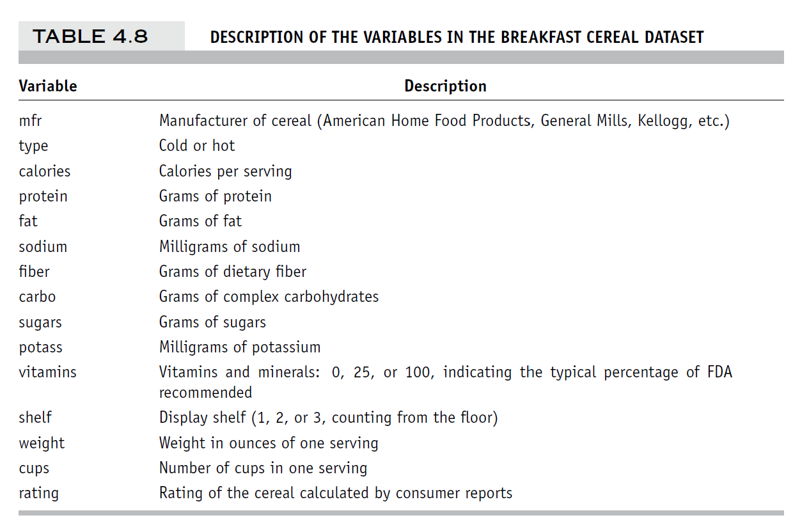

<style type="text/css">
  body{
  font-size: 8pt;
}
</style>

```{r setup, include=FALSE}

knitr::opts_chunk$set(echo = TRUE, warning=FALSE, comment=FALSE, message=FALSE, error = FALSE)

```

# <span style="color: #1c6155;">Loading Packages</span> 

```{r loading packages}

library(data.table) # Efficient Dataframe 
library(lubridate) # For Dates 
library(tidyverse) # Multiple Package for Useful Data wrangling
library(esquisse) # Intuitive plotting
library(plyr) # Data splitting
library(dplyr) # Data Wrangling
library(ggplot2) # Plot Graphs
library(naniar) # for NA exploration in Dataframe
library(plotly) # Make ggplot2 Dynamic
library(gridExtra) # Multiple Plot at once
library(RColorBrewer) # For Color Palette
library(rmdformats) # Theme of HTML
library(flextable) # Show Table
library(class) # K-NN
library(summarytools) # Beautiful and Efficient Summary for Dataset
library(pivottabler) # Pivot Table
library(naivebayes) # Naive Bayes Function
library(caret) # Confusion Matrix
library(leaps) # Exhaustive Search
library(forecast) # Predictions
library(neuralnet) # Neural Network
library(nnet) # Neural Network
library(manipulateWidget) # Plotly Combiner
library(rpart) # Regression Tree
library(rpart.plot) # Plotting Regression Tree
library(gains) # Lift Chart
library(adabag) # Boosting and Bagging
library(FactoMineR) # Clustering
library(factoextra) # Clustering
library(NbClust) # Optimal Clustering
library(qacr) # Clusters Profiling | install with: remotes::install_github("rkabacoff/qacr")
library(dendextend) # Cluster Dendrogram

```


# <span style="color: #1c6155;">Dataset Preparation</span> 

```{r clean environment, include=FALSE}

# Clean Environment
rm(list = ls()) 

```

## Loading all dataset: Cereals.csv, eBayAuctions.csv and UniversalBank.csv

```{r loading dataset}

Cereals <- fread("data/Cereals.csv")
eBay <- fread("data/eBayAuctions.csv")
UniversalBank <- fread("data/UniversalBank.csv")

```


## Cereals.csv

## Quick Preview 

```{r preview of dataset Cereals}

# Preview of the Dataset
DT::datatable(head(Cereals,2))

```

<center>



</center>


```{r summary of dataset Cereals,results="asis"}

dfSummary(Cereals, 
          plain.ascii  = FALSE, 
          style        = "grid", 
          graph.magnif = 0.75, 
          valid.col    = FALSE,
          tmp.img.dir  = "/tmp")

```

> We can see that **Potass** tend to be right skewed with **Fiber** as well. **Rating** as some outliers in the far right and weight seems to be very centralized as well as **Calories**, having far outliers at both sides.  

## Missing Variables Plot 

<center>

```{r missing variable plot Cereals, results='hide'}

# Missing Variables Plot for the Dataset
gg_miss_var(Cereals, show_pct = TRUE)

# NA % per variables
mean(is.na(Cereals$potass))
mean(is.na(Cereals$sugars))
mean(is.na(Cereals$carbo))

# NA % for whole dataseet
mean(is.na(Cereals))


```

</center>

> Cereals.csv has some missing values, such as **Potass** (2.6%), **Sugars** (1.3%) and **Carbo** (1.3%). The dataset has a proportion of 0.32% missing values. 

## eBayAuction.csv

## Quick Preview 

```{r preview of dataset eBay}

# Preview of the Dataset
DT::datatable(head(eBay,2))

```


```{r summary of dataset eBay,results="asis"}

dfSummary(eBay, 
          plain.ascii  = FALSE, 
          style        = "grid", 
          graph.magnif = 0.75, 
          valid.col    = FALSE,
          tmp.img.dir  = "/tmp")

```

> We can see that **sellerRating** tend to have a lot of right outliers. **Duration** tend to be left skewed with **endDay** as well (having more **endDay** on Monday for example.)


## Missing Variables Plot 

<center>

```{r missing variable plot eBay}

# Missing Variables Plot for the Dataset
gg_miss_var(eBay, show_pct = TRUE)

```

</center>

> eBayAuction.csv has no missing value.

## UniversalBank.csv

## Quick Preview 

```{r preview of dataset UniversalBank}

# Preview of the Dataset
DT::datatable(head(UniversalBank,2))

```


```{r summary of dataset UniversalBank,results="asis"}

dfSummary(UniversalBank, 
          plain.ascii  = FALSE, 
          style        = "grid", 
          graph.magnif = 0.75, 
          valid.col    = FALSE,
          tmp.img.dir  = "/tmp")

```

> We can see that **Experience** has some negative values in its range, thus questionning the way we should interpret **Experience** depending on the reference point. In our case lacking information from this dataset leave us keeping those variables as such. In a very different scenario, knowing that the survey could offer negative experience values would oblige us to dig in further the data collection and survey processes and question how accurate are the values in our dataset and how we collected them. We can see that a lot of variables are very right skewed (**CCAvg**, **Income** or **Mortgage**). 

## Missing Variables Plot 

<center>

```{r missing variable plot UniversalBank}

# Missing Variables Plot for the Dataset
gg_miss_var(UniversalBank, show_pct = TRUE)

```

</center>


> UniversalBank.csv has no missing value.


# <span style="color: #1c6155;">Ex 13.1</span> 

```{r clean environment 2, include=FALSE}

# Clean Environment
rm(list = ls()) 

```

## **Acceptance of Consumer Loan**

```{r loading UniversalBank}

# Loading Universal.csv
UniversalBank <- fread("data/UniversalBank.csv")

# Removing ZIP Code and ID
UniversalBank <- UniversalBank[,-c("ZIP Code","ID")]

```

## Partition the data: 60% training, 40% validation.

```{r Partition the data}

# Setting Seed
set.seed(1)

# Training and Validation Proportion
Training_Proportion <- 0.6
Validation_Proportion <- 1-Training_Proportion

# Splitting
sample <- sample(c(TRUE, FALSE), nrow(UniversalBank), replace=TRUE, prob=c(Training_Proportion,Validation_Proportion))

UB_Training  <- UniversalBank[sample, ]

UB_Validation   <- UniversalBank[!sample, ]

# Checking Proportions
Training_Proportion_Check <- nrow(UB_Training)/nrow(UniversalBank)
Validation_Proportion_Check <- nrow(UB_Validation)/nrow(UniversalBank)

# Printing Result Check
print(paste("Proportion in Training is", Training_Proportion_Check*100,"%", "and in Validation is",Validation_Proportion_Check*100,"%"))


```

## a. Fit Models to the data for (1) logistic regression, (2) k-nearest neighbors with *k* = 3, and (3) Classification trees.

> Use Personal Loan as the outcome variable. Report the validation confusion matrix for each of the three models. 

### <span style="color: #1c6155;">Logistic Regression</span> 

```{r LR}

# Set Seed 
set.seed(1)

# Duplicate the UniversalBank
LR_Training <- UB_Training
LR_Validation <- UB_Validation

# Target Variable As Factor
LR_Training$`Personal Loan` <- factor(LR_Training$`Personal Loan`, levels = c(0,1),labels = c("No Loan","Loan")) 
LR_Validation$`Personal Loan` <- factor(LR_Validation$`Personal Loan`, levels = c(0,1),labels = c("No Loan","Loan"))

# Factor Education
LR_Training$Education <- factor(LR_Training$Education, levels = c(1, 2, 3), labels = c("Undergrad", "Graduate", "Advanced/Professional"))
LR_Validation$Education <- factor(LR_Validation$Education, levels = c(1, 2, 3), labels = c("Undergrad", "Graduate", "Advanced/Professional"))

# Run logistic regression
logit.reg <- glm(`Personal Loan` ~ ., data = LR_Training, family = "binomial")
options(scipen=999)

# Give the Summary of the logistic Regression
summary(logit.reg)


```

> Comments: We can see that **Mortgage**, **Securities Account**, **Age** and **Experience** are not statistically significant in this logistic regression. **Income**, **EducationGraduate** and **EducationAdvanced/Professional** with **CD Account** seems to be really significant in this model with a very low p-value. **EducationAdvanced/Professional**, **EducationGraduate** and **CD Account** seems to have the most positive impact in wether or not a individual may contract a Loan or not. One possibility would be to use different method for variable selections in this logistic regression (that would certainly remove some unsignificant variables) or even rescale variable by log in case of some skewed distributions. In this case removing variables would certainly improve the model by adding more weight to the most important and statistically significant variables and thus the predictions. In our case, we only mention the possibility but we do not go through those steps, since we are trying to compare all variables predictors to each of the models without optimizing it and to have a fair comparison. 

#### <span style="color: #1c6155;">Predictions and Confusion Matrix</span>

<center>

```{r LR Predictions and Confusion Matrix}

# Set Seed 
set.seed(1)

# Predictions with LR
logit.reg.pred <- predict(logit.reg, LR_Validation[, -c("`Personal Loan`")], type = "response")

# Rounding Predictions - 0.5 Threshold
logit.reg.pred_round <- round(logit.reg.pred)

# As Numeric
logit.reg.pred_round <- as.numeric(logit.reg.pred_round)

# Check rounding
dataframe_predictions <- cbind(logit.reg.pred, logit.reg.pred_round)

# Predictions as Factor
logit.reg.pred_round <- factor(logit.reg.pred_round, levels = c(0,1),labels = c("No Loan","Loan"))

# Confusion Matrix
Confusion_Matrix_LR <- confusionMatrix(data = logit.reg.pred_round, reference = LR_Validation$`Personal Loan`)

# Create the Function for Confusion Matrix
draw_confusion_matrix_LR <- function(cm) {

  layout(matrix(c(1,1,2)))
  par(mar=c(2,2,2,2))
  plot(c(100, 345), c(300, 450), type = "n", xlab="", ylab="", xaxt='n', yaxt='n')
  title('CONFUSION MATRIX for Logistic Regression', cex.main=2)

  # create the matrix 
  rect(150, 430, 240, 370, col='#1c6155')
  text(195, 435, 'No Loan', cex=1.2)
  rect(250, 430, 340, 370, col='#1c615570')
  text(295, 435, 'Loan', cex=1.2)
  text(125, 370, 'Predicted', cex=1.3, srt=90, font=2)
  text(245, 450, 'Actual', cex=1.3, font=2)
  rect(150, 305, 240, 365, col='#1c615570')
  rect(250, 305, 340, 365, col='#1c6155')
  text(140, 400, 'No Loan', cex=1.2, srt=90)
  text(140, 335, 'Loan', cex=1.2, srt=90)

  # add in the cm results 
  res <- as.numeric(cm$table)
  text(195, 400, res[1], cex=1.6, font=2, col='white')
  text(195, 335, res[2], cex=1.6, font=2, col='white')
  text(295, 400, res[3], cex=1.6, font=2, col='white')
  text(295, 335, res[4], cex=1.6, font=2, col='white')

  # add in the specifics 
  plot(c(100, 0), c(100, 0), type = "n", xlab="", ylab="", main = "DETAILS", xaxt='n', yaxt='n')
  text(10, 85, names(cm$byClass[1]), cex=1.2, font=2)
  text(10, 70, round(as.numeric(cm$byClass[1]), 3), cex=1.2)
  text(30, 85, names(cm$byClass[2]), cex=1.2, font=2)
  text(30, 70, round(as.numeric(cm$byClass[2]), 3), cex=1.2)
  text(50, 85, names(cm$byClass[5]), cex=1.2, font=2)
  text(50, 70, round(as.numeric(cm$byClass[5]), 3), cex=1.2)
  text(70, 85, names(cm$byClass[6]), cex=1.2, font=2)
  text(70, 70, round(as.numeric(cm$byClass[6]), 3), cex=1.2)
  text(90, 85, names(cm$byClass[7]), cex=1.2, font=2)
  text(90, 70, round(as.numeric(cm$byClass[7]), 3), cex=1.2)

  # add in the accuracy information 
  text(30, 35, names(cm$overall[1]), cex=1.5, font=2)
  text(30, 20, round(as.numeric(cm$overall[1]), 3), cex=1.4)
  text(70, 35, names(cm$overall[2]), cex=1.5, font=2)
  text(70, 20, round(as.numeric(cm$overall[2]), 3), cex=1.4)
}

# Plot the Confusion Matrix
draw_confusion_matrix_LR(Confusion_Matrix_LR)

```

</center>

> Comments: The Confusion Matrix shows us an Accuracy of 0.949 with the Logistic Regression Model, but we have a very bad specificity, meaning that the model fails to give us good prediction for the True Negative, which are here Loan, thus our main goal in the predictive model. 


### <span style="color: #1c6155;">K-nearest neighbors with *k* = 3</span> 

#### Data Preprocessing 

```{r Preprocess for KNN}

# Set Seed 
set.seed(1)

# Target Variable As Factor
UB_Training$`Personal Loan` <- factor(UB_Training$`Personal Loan`, levels = c(0,1),labels = c("No Loan","Loan")) 

UB_Validation$`Personal Loan` <- factor(UB_Validation$`Personal Loan`, levels = c(0,1),labels = c("No Loan","Loan"))

# Education as Factor
UB_Training$Education <- factor(UB_Training$Education)

UB_Validation$Education <- factor(UB_Validation$Education)

# Library Caret
library(caret)

# Dummy for Education
dummy <- dummyVars(" ~ Education", data=UB_Training)
Education_Dummy <- data.frame(predict(dummy, newdata = UB_Training)) 

dummy_2 <- dummyVars(" ~ Education", data=UB_Validation)
Education_Dummy_2 <- data.frame(predict(dummy, newdata = UB_Validation)) 

# Remove Education and add hot-encoded dummies 
UB_Training <- UB_Training[,-c("Education")]
UB_Training <- cbind(UB_Training,Education_Dummy)

UB_Validation <- UB_Validation[,-c("Education")]
UB_Validation <- cbind(UB_Validation,Education_Dummy_2)

# Duplicate Dataset for Preprocess
UB_Training_Preprocess <- UB_Training
UB_Validation_Preprocess <- UB_Validation

# Remove Dummies
UB_Training_Preprocess <- UB_Training_Preprocess[,-c("Personal Loan","Online","CreditCard","Securities Account","CD Account","Education.1","Education.2","Education.3")]

# Preprocess 
norm_values <- preProcess(UB_Training_Preprocess, method = c("center","scale"))

UB_Training_Preprocess <- predict(norm_values,UB_Training)
UB_Validation_Preprocess <- predict(norm_values, UB_Validation)


```


#### <span style="color: #1c6155;">Predictions and Confusion Matrix</span>

<center>

```{r KNN and Confusion Matrix}

# Set Seed 
set.seed(1)

# Packages
library(class)
library(caret)

# Choosing our K value
k <- 3

# KNN
NEW_KNN3 <- knn3(y = UB_Training_Preprocess$`Personal Loan`, x=UB_Training_Preprocess[,-c("Personal Loan")], k=k)

# KNN Probabilities output
Predictions_KNN_Training <- predict(NEW_KNN3, UB_Validation_Preprocess[,-c("Personal Loan")], type = "class")
Predictions_KNN_Training_Proba <- predict(NEW_KNN3, UB_Validation_Preprocess[,-c("Personal Loan")], type = "prob")[,2]

# Confusion Matrix
Confusion_Matrix_KNN <- confusionMatrix(data = Predictions_KNN_Training, reference = UB_Validation$`Personal Loan`)

# Create the Function for Confusion Matrix
draw_confusion_matrix_KNN <- function(cm) {

  layout(matrix(c(1,1,2)))
  par(mar=c(2,2,2,2))
  plot(c(100, 345), c(300, 450), type = "n", xlab="", ylab="", xaxt='n', yaxt='n')
  title('CONFUSION MATRIX for KNN with k=3', cex.main=2)

  # create the matrix 
  rect(150, 430, 240, 370, col='#1c6155')
  text(195, 435, 'No Loan', cex=1.2)
  rect(250, 430, 340, 370, col='#1c615570')
  text(295, 435, 'Loan', cex=1.2)
  text(125, 370, 'Predicted', cex=1.3, srt=90, font=2)
  text(245, 450, 'Actual', cex=1.3, font=2)
  rect(150, 305, 240, 365, col='#1c615570')
  rect(250, 305, 340, 365, col='#1c6155')
  text(140, 400, 'No Loan', cex=1.2, srt=90)
  text(140, 335, 'Loan', cex=1.2, srt=90)

  # add in the cm results 
  res <- as.numeric(cm$table)
  text(195, 400, res[1], cex=1.6, font=2, col='white')
  text(195, 335, res[2], cex=1.6, font=2, col='white')
  text(295, 400, res[3], cex=1.6, font=2, col='white')
  text(295, 335, res[4], cex=1.6, font=2, col='white')

  # add in the specifics 
  plot(c(100, 0), c(100, 0), type = "n", xlab="", ylab="", main = "DETAILS", xaxt='n', yaxt='n')
  text(10, 85, names(cm$byClass[1]), cex=1.2, font=2)
  text(10, 70, round(as.numeric(cm$byClass[1]), 3), cex=1.2)
  text(30, 85, names(cm$byClass[2]), cex=1.2, font=2)
  text(30, 70, round(as.numeric(cm$byClass[2]), 3), cex=1.2)
  text(50, 85, names(cm$byClass[5]), cex=1.2, font=2)
  text(50, 70, round(as.numeric(cm$byClass[5]), 3), cex=1.2)
  text(70, 85, names(cm$byClass[6]), cex=1.2, font=2)
  text(70, 70, round(as.numeric(cm$byClass[6]), 3), cex=1.2)
  text(90, 85, names(cm$byClass[7]), cex=1.2, font=2)
  text(90, 70, round(as.numeric(cm$byClass[7]), 3), cex=1.2)

  # add in the accuracy information 
  text(30, 35, names(cm$overall[1]), cex=1.5, font=2)
  text(30, 20, round(as.numeric(cm$overall[1]), 3), cex=1.4)
  text(70, 35, names(cm$overall[2]), cex=1.5, font=2)
  text(70, 20, round(as.numeric(cm$overall[2]), 3), cex=1.4)
}

# Plot the Confusion Matrix
draw_confusion_matrix_KNN(Confusion_Matrix_KNN)

```

</center>

> Comments: KNN Confusion Matrix shows us a slightly better accuracy than Regression Model, with Accuracy of 0.969 and a better Specificity of 0.683.


### <span style="color: #1c6155;">Classification Trees</span>

<center>

```{r CT}

# Set Seed 
set.seed(1)

# Tree Packages
library(rpart)
library(rpart.plot)

# Running Tree
CT <- rpart(UB_Training$`Personal Loan` ~ . , data=UB_Training)

# Plotting Tree
CT_Plot <- rpart.plot(CT, type=0, varlen = 0, box.col=ifelse(CT$frame$var == "<leaf>", '#8db0aa', 'white'), fallen.leaves = FALSE, extra = FALSE, main="Classification Trees", cex.main=1.5)

```

</center>

> Comments: We can see that Classification Trees give us very different predictor variables. **Income**, **CCAvg** and **Education.1** give the main split in the Trees, then **CD Account**, **Family** and **Income** again split further more to the main terminal nodes until **CCAvg** fo the 4th split. 

#### <span style="color: #1c6155;">Predictions and Confusion Matrix</span>

<center>

```{r CT Predictions and Confusion Matrix}

# Set Seed 
set.seed(1)

# Predictions 
CT_Predictions <- predict(CT, UB_Validation, type = 'class')
CT_Predictions_Proba <- predict(CT, UB_Validation, type = 'prob')

# Confusion Matrix
Confusion_Matrix_CT <- confusionMatrix(data = CT_Predictions, reference = UB_Validation$`Personal Loan`)

# Create the Function for Confusion Matrix
draw_confusion_matrix_CT <- function(cm) {

  layout(matrix(c(1,1,2)))
  par(mar=c(2,2,2,2))
  plot(c(100, 345), c(300, 450), type = "n", xlab="", ylab="", xaxt='n', yaxt='n')
  title('CONFUSION MATRIX for Classification Trees', cex.main=2)

  # create the matrix 
  rect(150, 430, 240, 370, col='#1c6155')
  text(195, 435, 'No Loan', cex=1.2)
  rect(250, 430, 340, 370, col='#1c615570')
  text(295, 435, 'Loan', cex=1.2)
  text(125, 370, 'Predicted', cex=1.3, srt=90, font=2)
  text(245, 450, 'Actual', cex=1.3, font=2)
  rect(150, 305, 240, 365, col='#1c615570')
  rect(250, 305, 340, 365, col='#1c6155')
  text(140, 400, 'No Loan', cex=1.2, srt=90)
  text(140, 335, 'Loan', cex=1.2, srt=90)

  # add in the cm results 
  res <- as.numeric(cm$table)
  text(195, 400, res[1], cex=1.6, font=2, col='white')
  text(195, 335, res[2], cex=1.6, font=2, col='white')
  text(295, 400, res[3], cex=1.6, font=2, col='white')
  text(295, 335, res[4], cex=1.6, font=2, col='white')

  # add in the specifics 
  plot(c(100, 0), c(100, 0), type = "n", xlab="", ylab="", main = "DETAILS", xaxt='n', yaxt='n')
  text(10, 85, names(cm$byClass[1]), cex=1.2, font=2)
  text(10, 70, round(as.numeric(cm$byClass[1]), 3), cex=1.2)
  text(30, 85, names(cm$byClass[2]), cex=1.2, font=2)
  text(30, 70, round(as.numeric(cm$byClass[2]), 3), cex=1.2)
  text(50, 85, names(cm$byClass[5]), cex=1.2, font=2)
  text(50, 70, round(as.numeric(cm$byClass[5]), 3), cex=1.2)
  text(70, 85, names(cm$byClass[6]), cex=1.2, font=2)
  text(70, 70, round(as.numeric(cm$byClass[6]), 3), cex=1.2)
  text(90, 85, names(cm$byClass[7]), cex=1.2, font=2)
  text(90, 70, round(as.numeric(cm$byClass[7]), 3), cex=1.2)

  # add in the accuracy information 
  text(30, 35, names(cm$overall[1]), cex=1.5, font=2)
  text(30, 20, round(as.numeric(cm$overall[1]), 3), cex=1.4)
  text(70, 35, names(cm$overall[2]), cex=1.5, font=2)
  text(70, 20, round(as.numeric(cm$overall[2]), 3), cex=1.4)
}

# Plot the Confusion Matrix
draw_confusion_matrix_CT(Confusion_Matrix_CT)


```

</center>

> Comments: Classification Trees Confusion Matrix give us a way better look at the overall improvement in Specificity and Accuracy. Specifity is now 0.836 way better than previously and Accuracy raise up to 0.982, thus very close to an alpha error of 0.01.


### <span style="color: #1c6155;">Most Accurate Model</span>

```{r most accurate model}

Accuracy_CT <- Confusion_Matrix_CT$overall[1]

Accuracy_KNN <- Confusion_Matrix_KNN$overall[1]

Accuracy_LR <- Confusion_Matrix_LR$overall[1]

Accuracy_DF <- data.frame(Accuracy_CT,Accuracy_KNN,Accuracy_LR)

Accuracy_DF <- as.data.frame(Accuracy_DF)

# Plotting Accuracy
data.table(Accuracy_DF)

```

> Comments: The most accurate model is the Classification Trees, having at least 98.1% accurate predictions (Training against Validation), the lowest accuracy model is the Logistic Regression with 94.8% Accuracy. 


## b. Create Dataframe with the actual outcome, predicted outcome, and each of the tree models

<center>

```{r create dataframe b}

# Creating Actual VERSUS Predicted Dataframe
LR_Dataframe <- data.frame(logit.reg.pred_round)
KNN_Dataframe <- data.frame(Predictions_KNN_Training)
CT_Dataframe <- data.frame(CT_Predictions)

All_Models_Predictions <- cbind(LR_Dataframe,KNN_Dataframe,CT_Dataframe, UB_Validation$`Personal Loan`)

# Changing Columns Name
colnames(All_Models_Predictions)[1] <- "Predicted - LR"
colnames(All_Models_Predictions)[2] <- "Predicted - KNN"
colnames(All_Models_Predictions)[3] <- "Predicted - CT"
colnames(All_Models_Predictions)[4] <- "Actual"

# Showing Dataframes 
DT::datatable(All_Models_Predictions, caption = "Predicted VS Actual Loan in Validation - 3 Models") 

```

</center>


## c. Add two columns, a majority vote predicted of outcome and the average of predited probabilities. Derive a confusion matrix for each method and report the overall accuracy. 


### <span style="color: #1c6155;">Majority Vote Column</span> 

```{r majority vote}

# Majority Column
All_Models_Predictions$Majority <- 0

# As Numeric LR
All_Models_Predictions$`Predicted - LR` <- as.numeric(All_Models_Predictions$`Predicted - LR`)
All_Models_Predictions$`Predicted - LR` <- All_Models_Predictions$`Predicted - LR` -1

# As Numeric KNN
All_Models_Predictions$`Predicted - KNN` <- as.numeric(All_Models_Predictions$`Predicted - KNN`)
All_Models_Predictions$`Predicted - KNN` <- All_Models_Predictions$`Predicted - KNN` -1

# As Numeric CT
All_Models_Predictions$`Predicted - CT` <- as.numeric(All_Models_Predictions$`Predicted - CT`)
All_Models_Predictions$`Predicted - CT` <- All_Models_Predictions$`Predicted - CT` -1

# As Numeric Actual
All_Models_Predictions$Actual <- as.numeric(All_Models_Predictions$Actual)
All_Models_Predictions$Actual <- All_Models_Predictions$Actual -1

# Majority Vote
for(i in 1:nrow(All_Models_Predictions)){
  if(sum(All_Models_Predictions[i,1] + All_Models_Predictions[i,2] + All_Models_Predictions[i,3])/3 > 0.5){
    All_Models_Predictions[i,5] = 1
    }
}

# As Factor again
All_Models_Predictions$`Predicted - LR` <- factor(All_Models_Predictions$`Predicted - LR`, levels = c(0,1),labels = c("No Loan","Loan"))
All_Models_Predictions$`Predicted - KNN` <- factor(All_Models_Predictions$`Predicted - KNN`, levels = c(0,1),labels = c("No Loan","Loan"))
All_Models_Predictions$`Predicted - CT` <- factor(All_Models_Predictions$`Predicted - CT`, levels = c(0,1),labels = c("No Loan","Loan"))
All_Models_Predictions$Actual <- factor(All_Models_Predictions$Actual, levels = c(0,1),labels = c("No Loan","Loan"))
All_Models_Predictions$Majority <- factor(All_Models_Predictions$Majority, levels = c(0,1),labels = c("No Loan","Loan"))

# Show Majority Column
DT::datatable(All_Models_Predictions, caption = "Predicted VS Actual Loan in Validation (Majority Vote Added) - 3 Models") 

```

#### <span style="color: #1c6155;">Confusion Matrix with the Majority Vote</span> 

<center>

```{r majority vote confusion matrix}

# Confusion Matrix
Confusion_Matrix_Majority <- confusionMatrix(data = All_Models_Predictions$Majority, reference = All_Models_Predictions$Actual)

# Create the Function for Confusion Matrix
draw_confusion_matrix_Majority <- function(cm) {

  layout(matrix(c(1,1,2)))
  par(mar=c(2,2,2,2))
  plot(c(100, 345), c(300, 450), type = "n", xlab="", ylab="", xaxt='n', yaxt='n')
  title('CONFUSION MATRIX for Majority of Votes', cex.main=2)

  # create the matrix 
  rect(150, 430, 240, 370, col='#1c6155')
  text(195, 435, 'No Loan', cex=1.2)
  rect(250, 430, 340, 370, col='#1c615570')
  text(295, 435, 'Loan', cex=1.2)
  text(125, 370, 'Predicted', cex=1.3, srt=90, font=2)
  text(245, 450, 'Actual', cex=1.3, font=2)
  rect(150, 305, 240, 365, col='#1c615570')
  rect(250, 305, 340, 365, col='#1c6155')
  text(140, 400, 'No Loan', cex=1.2, srt=90)
  text(140, 335, 'Loan', cex=1.2, srt=90)

  # add in the cm results 
  res <- as.numeric(cm$table)
  text(195, 400, res[1], cex=1.6, font=2, col='white')
  text(195, 335, res[2], cex=1.6, font=2, col='white')
  text(295, 400, res[3], cex=1.6, font=2, col='white')
  text(295, 335, res[4], cex=1.6, font=2, col='white')

  # add in the specifics 
  plot(c(100, 0), c(100, 0), type = "n", xlab="", ylab="", main = "DETAILS", xaxt='n', yaxt='n')
  text(10, 85, names(cm$byClass[1]), cex=1.2, font=2)
  text(10, 70, round(as.numeric(cm$byClass[1]), 3), cex=1.2)
  text(30, 85, names(cm$byClass[2]), cex=1.2, font=2)
  text(30, 70, round(as.numeric(cm$byClass[2]), 3), cex=1.2)
  text(50, 85, names(cm$byClass[5]), cex=1.2, font=2)
  text(50, 70, round(as.numeric(cm$byClass[5]), 3), cex=1.2)
  text(70, 85, names(cm$byClass[6]), cex=1.2, font=2)
  text(70, 70, round(as.numeric(cm$byClass[6]), 3), cex=1.2)
  text(90, 85, names(cm$byClass[7]), cex=1.2, font=2)
  text(90, 70, round(as.numeric(cm$byClass[7]), 3), cex=1.2)

  # add in the accuracy information 
  text(30, 35, names(cm$overall[1]), cex=1.5, font=2)
  text(30, 20, round(as.numeric(cm$overall[1]), 3), cex=1.4)
  text(70, 35, names(cm$overall[2]), cex=1.5, font=2)
  text(70, 20, round(as.numeric(cm$overall[2]), 3), cex=1.4)
}

# Plot the Confusion Matrix
draw_confusion_matrix_Majority(Confusion_Matrix_Majority)

```

</center>

> Comments: The Majority Vote has an accuracy of 97.2%, which is slighty better than RT and KNN but less accurate than CT. The Specificity decreased here compared to CT, since we have 0.71.

### <span style="color: #1c6155;">Average of Predicted Probabilities</span> 

```{r Average}

All_Models_Predictions$Average <- NA

# Average Vote
for(i in 1:nrow(All_Models_Predictions)){
  All_Models_Predictions$Average[i] =  (CT_Predictions_Proba[i,2] + logit.reg.pred[i] + Predictions_KNN_Training_Proba[i])/3
}

# Round Average Vote to 4th Decimals
All_Models_Predictions$Average <- round(All_Models_Predictions[,6],4)

# Show Average Column with Probabilities
DT::datatable(All_Models_Predictions, caption = "Predicted VS Actual Loan in Validation (Average Probabilities Added) - 3 Models") 

# Change Probabilities to 0 or 1 with cutoff = 0.5
for(i in 1:nrow(All_Models_Predictions)){
  if(All_Models_Predictions[i,6] > 0.5){
    All_Models_Predictions[i,6] = 1
  }
  else{ 
    All_Models_Predictions[i,6] = 0
    }
}

# As Factor Average
All_Models_Predictions$Average <- factor(All_Models_Predictions$Average, levels = c(0,1),labels = c("No Loan","Loan"))

# Show Average Column with Probabilities
DT::datatable(All_Models_Predictions, caption = "Predicted VS Actual Loan in Validation (Average Added) - 3 Models") 

```


#### <span style="color: #1c6155;">Confusion Matrix with the Average Predicted Probabilities</span>

[Github Repo for this Homework 4](https://github.com/LiamPhan17/DATA_MINING_HW4)

[Data Mining for Business Analytics: Concepts, Techniques, and Applications in R](https://www.wiley.com/en-us/Data+Mining+for+Business+Analytics:+Concepts,+Techniques,+and+Applications+in+R-p-9781118879368)

[Summarytools in R Markdown Documents](https://cran.r-project.org/web/packages/summarytools/vignettes/rmarkdown.html)

[R Function: Gain and Lift Table](https://www.listendata.com/2015/06/r-function-gain-and-lift-table.html)

[How does ties.method argument in R's Rank Function Work?](https://stats.stackexchange.com/questions/34008/how-does-ties-method-argument-of-rs-rank-function-work)

[For hierarchical clustering, how to find the “center” in each cluster in R](https://stackoverflow.com/questions/60643219/for-hierarchical-clustering-how-to-find-the-center-in-each-cluster-in-r)

[Determining The Optimal Number Of Clusters: 3 Must Know Methods](http://www.sthda.com/english/articles/29-cluster-validation-essentials/96-determiningthe-optimal-number-of-clusters-3-must-know-methods/)

[10 Tips On How To Find The Healthiest Cereals - pickyeaterblog.com](https://pickyeaterblog.com/the-picky-eaters-10-healthiest-breakfast-cereals/)

[Plotting Confusion Matrix in R - Stackoverflow](https://stackoverflow.com/questions/23891140/r-how-to-visualize-confusion-matrix-using-the-caret-package) 

[Cluster profile plots - Gihtub](https://rkabacoff.github.io/qacr/reference/profile_plot.html)


<center>

```{r Average confusion matrix}

# Confusion Matrix
Confusion_Matrix_Average <- confusionMatrix(data = All_Models_Predictions$Average, reference = All_Models_Predictions$Actual)

# Create the Function for Confusion Matrix
draw_confusion_matrix_Average <- function(cm) {

  layout(matrix(c(1,1,2)))
  par(mar=c(2,2,2,2))
  plot(c(100, 345), c(300, 450), type = "n", xlab="", ylab="", xaxt='n', yaxt='n')
  title('CONFUSION MATRIX for Average Predicted Probabilities', cex.main=2)

  # create the matrix 
  rect(150, 430, 240, 370, col='#1c6155')
  text(195, 435, 'No Loan', cex=1.2)
  rect(250, 430, 340, 370, col='#1c615570')
  text(295, 435, 'Loan', cex=1.2)
  text(125, 370, 'Predicted', cex=1.3, srt=90, font=2)
  text(245, 450, 'Actual', cex=1.3, font=2)
  rect(150, 305, 240, 365, col='#1c615570')
  rect(250, 305, 340, 365, col='#1c6155')
  text(140, 400, 'No Loan', cex=1.2, srt=90)
  text(140, 335, 'Loan', cex=1.2, srt=90)

  # add in the cm results 
  res <- as.numeric(cm$table)
  text(195, 400, res[1], cex=1.6, font=2, col='white')
  text(195, 335, res[2], cex=1.6, font=2, col='white')
  text(295, 400, res[3], cex=1.6, font=2, col='white')
  text(295, 335, res[4], cex=1.6, font=2, col='white')

  # add in the specifics 
  plot(c(100, 0), c(100, 0), type = "n", xlab="", ylab="", main = "DETAILS", xaxt='n', yaxt='n')
  text(10, 85, names(cm$byClass[1]), cex=1.2, font=2)
  text(10, 70, round(as.numeric(cm$byClass[1]), 3), cex=1.2)
  text(30, 85, names(cm$byClass[2]), cex=1.2, font=2)
  text(30, 70, round(as.numeric(cm$byClass[2]), 3), cex=1.2)
  text(50, 85, names(cm$byClass[5]), cex=1.2, font=2)
  text(50, 70, round(as.numeric(cm$byClass[5]), 3), cex=1.2)
  text(70, 85, names(cm$byClass[6]), cex=1.2, font=2)
  text(70, 70, round(as.numeric(cm$byClass[6]), 3), cex=1.2)
  text(90, 85, names(cm$byClass[7]), cex=1.2, font=2)
  text(90, 70, round(as.numeric(cm$byClass[7]), 3), cex=1.2)

  # add in the accuracy information 
  text(30, 35, names(cm$overall[1]), cex=1.5, font=2)
  text(30, 20, round(as.numeric(cm$overall[1]), 3), cex=1.4)
  text(70, 35, names(cm$overall[2]), cex=1.5, font=2)
  text(70, 20, round(as.numeric(cm$overall[2]), 3), cex=1.4)
}

# Plot the Confusion Matrix
draw_confusion_matrix_Average(Confusion_Matrix_Average)

```

</center>

> Comments: Averaging Probabilities of predictions give us a very slightly, by 0.4% improvement with the Specificity that is slightly better with 4.4% improvement.

## d. Compare Error Rates for the 3 individuals methods and the 2 ensemble methods. 

```{r Error Rates}

# Computing Error Rates

# Individual Methods
Error_CT <- 1-Accuracy_CT
Error_KNN <- 1-Accuracy_KNN
Error_LR <- 1-Accuracy_LR

# Ensembles Methods
Error_Majority <- 1-Confusion_Matrix_Majority$overall[1]
Error_Average <- 1-Confusion_Matrix_Average $overall[1]

# As Data frame 
Error_Rates_DF <- cbind(Error_LR,Error_KNN,Error_CT,Error_Majority,Error_Average)

# Rounding up to 5 decimals
Error_Rates_DF <- round(Error_Rates_DF,3)

DT::datatable(Error_Rates_DF, caption = "Error Rates from 3 Individual Methods and 2 Ensembles Methods") 

```

> Comments: CT is the one with the smallest error rate followed by Average Method and Majority Method. Since we are looking at having the best accuracy in the true negative, which are loan=1. So we would look at our Specificity and thus would choose Classification Trees since it have the highest rate. 

# <span style="color: #1c6155;">Ex 13.2</span> 

```{r clean environment 3, include=FALSE}

# Clean Environment
rm(list = ls()) 

```

## **eBay Auctions - Boosting and Bagging**

```{r loading eBay Auctions 2}

# Loading eBay Auctions
eBayAuction_DF <- fread("data/eBayAuctions.csv")

```

## Partition the data: 60% training, 40% validation.

```{r partition the data 2}

# Setting Seed
set.seed(1)

# Training and Validation Proportion
Training_Proportion <- 0.6
Validation_Proportion <- 1-Training_Proportion

# Splitting
sample <- sample(c(TRUE, FALSE), nrow(eBayAuction_DF), replace=TRUE, prob=c(Training_Proportion,Validation_Proportion))

EB_Training  <- eBayAuction_DF[sample, ]

EB_Validation   <- eBayAuction_DF[!sample, ]

# Checking Proportions
Training_Proportion_Check <- nrow(EB_Training)/nrow(eBayAuction_DF)
Validation_Proportion_Check <- nrow(EB_Validation)/nrow(eBayAuction_DF)

# Printing Result Check
print(paste("Proportion in Training is", round(Training_Proportion_Check*100),"%", "and in Validation is",round(Validation_Proportion_Check*100),"%"))

```


## a. Run a Classification Tree, using default controls of rpart()

### <span style="color: #1c6155;">Actual VS Predictions</span>

```{r CT and Validation Set Accuracy}

# Set Seed 
set.seed(1)

# Tree Packages
library(rpart)
library(rpart.plot)

# Duplicate before Factor
EB_Training_Pure <- EB_Training
EB_Validation_Pure <- EB_Validation

# Factor for outcome variable 
EB_Training$`Competitive?` <- factor(EB_Training$`Competitive?`, levels = c(0,1),labels = c("No","Yes")) 
EB_Validation$`Competitive?` <- factor(EB_Validation$`Competitive?`, levels = c(0,1),labels = c("No","Yes")) 

# Running Classification Tree
CT <- rpart(EB_Training$`Competitive?` ~ . , data=EB_Training)

# Predict for Validation Set with CT
CT_Predictions <- predict(CT, EB_Validation, type = 'class')
CT_Predictions_Prob <- predict(CT, EB_Validation, type = 'prob')

# Check Actual VS Predicted
Predictions_Actual_CT <- data.frame(EB_Validation$`Competitive?`,CT_Predictions)

# Renaming Columns
colnames(Predictions_Actual_CT)[2] <- "Predicted"
colnames(Predictions_Actual_CT)[1] <- "Actual"

# Render Table
DT::datatable(Predictions_Actual_CT, caption = "Actual VS Predicted with Default Classification Trees") 

```

<center>

### <span style="color: #1c6155;">Confusion Matrix</span>

<center>

```{r Accuracy and Confusion Matrix CT}

# Set seed
set.seed(1)

# Confusion Matrix
Confusion_Matrix_CT_2 <- confusionMatrix(data = CT_Predictions, reference = EB_Validation$`Competitive?`)

# Create the Function for Confusion Matrix
draw_confusion_matrix_CT_2 <- function(cm) {

  layout(matrix(c(1,1,2)))
  par(mar=c(2,2,2,2))
  plot(c(100, 345), c(300, 450), type = "n", xlab="", ylab="", xaxt='n', yaxt='n')
  title('CONFUSION MATRIX for Default Classification Trees', cex.main=2)

  # create the matrix 
  rect(150, 430, 240, 370, col='#1c6155')
  text(195, 435, 'No', cex=1.2)
  rect(250, 430, 340, 370, col='#1c615570')
  text(295, 435, 'Yes', cex=1.2)
  text(125, 370, 'Predicted', cex=1.3, srt=90, font=2)
  text(245, 450, 'Actual', cex=1.3, font=2)
  rect(150, 305, 240, 365, col='#1c615570')
  rect(250, 305, 340, 365, col='#1c6155')
  text(140, 400, 'No', cex=1.2, srt=90)
  text(140, 335, 'Yes', cex=1.2, srt=90)

  # add in the cm results 
  res <- as.numeric(cm$table)
  text(195, 400, res[1], cex=1.6, font=2, col='white')
  text(195, 335, res[2], cex=1.6, font=2, col='white')
  text(295, 400, res[3], cex=1.6, font=2, col='white')
  text(295, 335, res[4], cex=1.6, font=2, col='white')

  # add in the specifics 
  plot(c(100, 0), c(100, 0), type = "n", xlab="", ylab="", main = "DETAILS", xaxt='n', yaxt='n')
  text(10, 85, names(cm$byClass[1]), cex=1.2, font=2)
  text(10, 70, round(as.numeric(cm$byClass[1]), 3), cex=1.2)
  text(30, 85, names(cm$byClass[2]), cex=1.2, font=2)
  text(30, 70, round(as.numeric(cm$byClass[2]), 3), cex=1.2)
  text(50, 85, names(cm$byClass[5]), cex=1.2, font=2)
  text(50, 70, round(as.numeric(cm$byClass[5]), 3), cex=1.2)
  text(70, 85, names(cm$byClass[6]), cex=1.2, font=2)
  text(70, 70, round(as.numeric(cm$byClass[6]), 3), cex=1.2)
  text(90, 85, names(cm$byClass[7]), cex=1.2, font=2)
  text(90, 70, round(as.numeric(cm$byClass[7]), 3), cex=1.2)

  # add in the accuracy information 
  text(30, 35, names(cm$overall[1]), cex=1.5, font=2)
  text(30, 20, round(as.numeric(cm$overall[1]), 3), cex=1.4)
  text(70, 35, names(cm$overall[2]), cex=1.5, font=2)
  text(70, 20, round(as.numeric(cm$overall[2]), 3), cex=1.4)
}

# Plot the Confusion Matrix
draw_confusion_matrix_CT_2(Confusion_Matrix_CT_2)

```


</center>

> Comments: The Overall Accuracy is 0.81 for this Default Classification Trees with a specificity of 0.716 and sensitivity of 0.915. The Model is better at True Positive than True Negative. 


### <span style="color: #1c6155;">Lift Chart</span>

<center>

```{r decile lift chart}

# Set seed
set.seed(1)

# Load Gains
library(gains)

# Compute Gains Chart
gain <- gains(as.numeric(as.character(EB_Validation_Pure$`Competitive?`)), CT_Predictions_Prob[,2], groups = 10, ties.method=c("first"))
barplot(gain$mean.resp / mean(as.numeric(as.character(EB_Validation_Pure$`Competitive?`))), names.arg = gain$depth, xlab = "Percentile",
ylab = "Mean Response", main = "Decile-wise lift chart", col = "#1c6155")

# Top Decile
library(lift)
print(paste("Top decile lift by ordering the data by the predictions, and computing the proportion of positives in the top 10%.","Here the top decile is",TopDecileLift(CT_Predictions_Prob[,2], as.numeric(as.character(EB_Validation_Pure$`Competitive?`)))))

```


</center>

> Comments: Our first decile is having a mean-response of 1.774. We can see that our first decile show us that our model is doing almost twice as better as a base random model. Then it quikly fall off from the 5th deciles and so on. 

## b. Run a boosted tree with the same predictors

<center>

```{r boosting Trees}

# Set seed
set.seed(1)

library(adabag)

# Duplicate Dataset for Boosting
EB_Training_Factor <- EB_Training

# Factor Before Boosting
EB_Training_Factor$Category <- factor(EB_Training_Factor$Category)
EB_Training_Factor$currency <- factor(EB_Training_Factor$currency)
EB_Training_Factor$endDay <- factor(EB_Training_Factor$endDay)


# Predictions 
boost <- boosting(`Competitive?` ~ ., data = EB_Training_Factor) 

Prediction_Boost <- predict(boost, EB_Validation, type="class")

Prediction_Boost_Factor <- as.factor(Prediction_Boost$class)

# Confusion Matrix
Confusion_Matrix_BOOST <- confusionMatrix(Prediction_Boost_Factor, EB_Validation$`Competitive?`)

# Create the Function for Confusion Matrix
draw_confusion_matrix_BOOST <- function(cm) {

  layout(matrix(c(1,1,2)))
  par(mar=c(2,2,2,2))
  plot(c(100, 345), c(300, 450), type = "n", xlab="", ylab="", xaxt='n', yaxt='n')
  title('CONFUSION MATRIX for Boosted Trees', cex.main=2)

  # create the matrix 
  rect(150, 430, 240, 370, col='#1c6155')
  text(195, 435, 'No', cex=1.2)
  rect(250, 430, 340, 370, col='#1c615570')
  text(295, 435, 'Yes', cex=1.2)
  text(125, 370, 'Predicted', cex=1.3, srt=90, font=2)
  text(245, 450, 'Actual', cex=1.3, font=2)
  rect(150, 305, 240, 365, col='#1c615570')
  rect(250, 305, 340, 365, col='#1c6155')
  text(140, 400, 'No', cex=1.2, srt=90)
  text(140, 335, 'Yes', cex=1.2, srt=90)

  # add in the cm results 
  res <- as.numeric(cm$table)
  text(195, 400, res[1], cex=1.6, font=2, col='white')
  text(195, 335, res[2], cex=1.6, font=2, col='white')
  text(295, 400, res[3], cex=1.6, font=2, col='white')
  text(295, 335, res[4], cex=1.6, font=2, col='white')

  # add in the specifics 
  plot(c(100, 0), c(100, 0), type = "n", xlab="", ylab="", main = "DETAILS", xaxt='n', yaxt='n')
  text(10, 85, names(cm$byClass[1]), cex=1.2, font=2)
  text(10, 70, round(as.numeric(cm$byClass[1]), 3), cex=1.2)
  text(30, 85, names(cm$byClass[2]), cex=1.2, font=2)
  text(30, 70, round(as.numeric(cm$byClass[2]), 3), cex=1.2)
  text(50, 85, names(cm$byClass[5]), cex=1.2, font=2)
  text(50, 70, round(as.numeric(cm$byClass[5]), 3), cex=1.2)
  text(70, 85, names(cm$byClass[6]), cex=1.2, font=2)
  text(70, 70, round(as.numeric(cm$byClass[6]), 3), cex=1.2)
  text(90, 85, names(cm$byClass[7]), cex=1.2, font=2)
  text(90, 70, round(as.numeric(cm$byClass[7]), 3), cex=1.2)

  # add in the accuracy information 
  text(30, 35, names(cm$overall[1]), cex=1.5, font=2)
  text(30, 20, round(as.numeric(cm$overall[1]), 3), cex=1.4)
  text(70, 35, names(cm$overall[2]), cex=1.5, font=2)
  text(70, 20, round(as.numeric(cm$overall[2]), 3), cex=1.4)
}

# Plot the Confusion Matrix
draw_confusion_matrix_BOOST(Confusion_Matrix_BOOST)

```


</center>


> Comments: The Overall Accuracy is 0.886 with a balanced Sensitivity and Specificity, both less than 0.9. The Specificity is better with Boosted Tree than Default Classification Trees. 

### <span style="color: #1c6155;">Lift Chart</span>

<center>

```{r Lift Chart BOOST}

# Set seed
set.seed(1)

# Load Gains
library(gains)

# Compute Gains Chart
gain_1 <- gains(as.numeric(as.character(EB_Validation_Pure$`Competitive?`)), Prediction_Boost$prob[,2], groups = 10, ties.method=c("first"))
barplot(gain_1$mean.resp / mean(as.numeric(as.character(EB_Validation_Pure$`Competitive?`))), names.arg = gain_1$depth, xlab = "Percentile",
ylab = "Mean Response", main = "Decile-wise lift chart", col = "#1c6155")

# Top Decile
library(lift)
print(paste("Top decile lift by ordering the data by the predictions, and computing the proportion of positives in the top 10%.","Here the top decile is",TopDecileLift(Prediction_Boost$prob[,2], as.numeric(as.character(EB_Validation_Pure$`Competitive?`)))))


```


</center>

> Comments: Our first decile is having a mean-response of 1.897. We can see that our first decile show us that our model is doing almost twice as better as a base random model. Then it quikly fall off from the 6th deciles and so on.

## c. Run a bagged tree with the same predictors

<center>

```{r bagged Trees}

# Set seed
set.seed(1)

# Load Package
library(adabag)

# Predictions
bag <- bagging(`Competitive?` ~ ., data = EB_Training) 

Prediction_Bagging <- predict(bag, EB_Validation, type="class")

Prediction_Bagging_Factor <- as.factor(Prediction_Bagging$class)

# Confusion Matrix
Confusion_Matrix_BT <- confusionMatrix(Prediction_Bagging_Factor, EB_Validation$`Competitive?`)

# Create the Function for Confusion Matrix
draw_confusion_matrix_BT <- function(cm) {

  layout(matrix(c(1,1,2)))
  par(mar=c(2,2,2,2))
  plot(c(100, 345), c(300, 450), type = "n", xlab="", ylab="", xaxt='n', yaxt='n')
  title('CONFUSION MATRIX for Bagged Trees', cex.main=2)

  # create the matrix 
  rect(150, 430, 240, 370, col='#1c6155')
  text(195, 435, 'No', cex=1.2)
  rect(250, 430, 340, 370, col='#1c615570')
  text(295, 435, 'Yes', cex=1.2)
  text(125, 370, 'Predicted', cex=1.3, srt=90, font=2)
  text(245, 450, 'Actual', cex=1.3, font=2)
  rect(150, 305, 240, 365, col='#1c615570')
  rect(250, 305, 340, 365, col='#1c6155')
  text(140, 400, 'No', cex=1.2, srt=90)
  text(140, 335, 'Yes', cex=1.2, srt=90)

  # add in the cm results 
  res <- as.numeric(cm$table)
  text(195, 400, res[1], cex=1.6, font=2, col='white')
  text(195, 335, res[2], cex=1.6, font=2, col='white')
  text(295, 400, res[3], cex=1.6, font=2, col='white')
  text(295, 335, res[4], cex=1.6, font=2, col='white')

  # add in the specifics 
  plot(c(100, 0), c(100, 0), type = "n", xlab="", ylab="", main = "DETAILS", xaxt='n', yaxt='n')
  text(10, 85, names(cm$byClass[1]), cex=1.2, font=2)
  text(10, 70, round(as.numeric(cm$byClass[1]), 3), cex=1.2)
  text(30, 85, names(cm$byClass[2]), cex=1.2, font=2)
  text(30, 70, round(as.numeric(cm$byClass[2]), 3), cex=1.2)
  text(50, 85, names(cm$byClass[5]), cex=1.2, font=2)
  text(50, 70, round(as.numeric(cm$byClass[5]), 3), cex=1.2)
  text(70, 85, names(cm$byClass[6]), cex=1.2, font=2)
  text(70, 70, round(as.numeric(cm$byClass[6]), 3), cex=1.2)
  text(90, 85, names(cm$byClass[7]), cex=1.2, font=2)
  text(90, 70, round(as.numeric(cm$byClass[7]), 3), cex=1.2)

  # add in the accuracy information 
  text(30, 35, names(cm$overall[1]), cex=1.5, font=2)
  text(30, 20, round(as.numeric(cm$overall[1]), 3), cex=1.4)
  text(70, 35, names(cm$overall[2]), cex=1.5, font=2)
  text(70, 20, round(as.numeric(cm$overall[2]), 3), cex=1.4)
}

# Plot the Confusion Matrix
draw_confusion_matrix_BT(Confusion_Matrix_BT)


```


</center>

> Comments: The Overall Accuracy is 0.853 for this Bagged Tree. The Sensitivity is larger than the Specificity such as in the Default Classification Trees and our Specificity is lower than the boosted Trees model. 

### <span style="color: #1c6155;">Lift Chart</span>

<center>

```{r Lift Chart BT}

# Set seed
set.seed(1)

# Load Gains
library(gains)

# Compute Gains Chart
gain_2 <- gains(as.numeric(as.character(EB_Validation_Pure$`Competitive?`)), Prediction_Bagging$prob[,2],groups = 10, ties.method=c("first"))
barplot(gain_2$mean.resp / mean(as.numeric(as.character(EB_Validation_Pure$`Competitive?`))), names.arg = gain_2$depth, xlab = "Percentile",
ylab = "Mean Response", main = "Decile-wise lift chart", col = "#1c6155")

# Top Decile
library(lift)
print(paste("Top decile lift by ordering the data by the predictions, and computing the proportion of positives in the top 10%.","Here the top decile is",TopDecileLift(Prediction_Bagging$prob[,2], as.numeric(as.character(EB_Validation_Pure$`Competitive?`)))))

```


</center>

> Comments: Our first decile is having a mean-response of 1.897. This Model is very, almost likely to give the same lift as the previous model.

## d. Run a random forest with argument mtry = 4

<center>

```{r random forest 1}

# Set seed
set.seed(1)

# Load Package
library(randomForest)

# Predictions
Random_Forest <- randomForest(EB_Training$`Competitive?` ~ ., data = EB_Training, mtry = 4)

Prediction_RF <- predict(Random_Forest, EB_Validation, type="class")

Prediction_RF_Prob <- predict(Random_Forest, EB_Validation, type="prob")

# Confusion Matrix
Confusion_Matrix_RF <- confusionMatrix(data = Prediction_RF, reference = EB_Validation$`Competitive?`)

# Create the Function for Confusion Matrix
draw_confusion_matrix_RF <- function(cm) {

  layout(matrix(c(1,1,2)))
  par(mar=c(2,2,2,2))
  plot(c(100, 345), c(300, 450), type = "n", xlab="", ylab="", xaxt='n', yaxt='n')
  title('CONFUSION MATRIX for Random Forests', cex.main=2)

  # create the matrix 
  rect(150, 430, 240, 370, col='#1c6155')
  text(195, 435, 'No', cex=1.2)
  rect(250, 430, 340, 370, col='#1c615570')
  text(295, 435, 'Yes', cex=1.2)
  text(125, 370, 'Predicted', cex=1.3, srt=90, font=2)
  text(245, 450, 'Actual', cex=1.3, font=2)
  rect(150, 305, 240, 365, col='#1c615570')
  rect(250, 305, 340, 365, col='#1c6155')
  text(140, 400, 'No', cex=1.2, srt=90)
  text(140, 335, 'Yes', cex=1.2, srt=90)

  # add in the cm results 
  res <- as.numeric(cm$table)
  text(195, 400, res[1], cex=1.6, font=2, col='white')
  text(195, 335, res[2], cex=1.6, font=2, col='white')
  text(295, 400, res[3], cex=1.6, font=2, col='white')
  text(295, 335, res[4], cex=1.6, font=2, col='white')

  # add in the specifics 
  plot(c(100, 0), c(100, 0), type = "n", xlab="", ylab="", main = "DETAILS", xaxt='n', yaxt='n')
  text(10, 85, names(cm$byClass[1]), cex=1.2, font=2)
  text(10, 70, round(as.numeric(cm$byClass[1]), 3), cex=1.2)
  text(30, 85, names(cm$byClass[2]), cex=1.2, font=2)
  text(30, 70, round(as.numeric(cm$byClass[2]), 3), cex=1.2)
  text(50, 85, names(cm$byClass[5]), cex=1.2, font=2)
  text(50, 70, round(as.numeric(cm$byClass[5]), 3), cex=1.2)
  text(70, 85, names(cm$byClass[6]), cex=1.2, font=2)
  text(70, 70, round(as.numeric(cm$byClass[6]), 3), cex=1.2)
  text(90, 85, names(cm$byClass[7]), cex=1.2, font=2)
  text(90, 70, round(as.numeric(cm$byClass[7]), 3), cex=1.2)

  # add in the accuracy information 
  text(30, 35, names(cm$overall[1]), cex=1.5, font=2)
  text(30, 20, round(as.numeric(cm$overall[1]), 3), cex=1.4)
  text(70, 35, names(cm$overall[2]), cex=1.5, font=2)
  text(70, 20, round(as.numeric(cm$overall[2]), 3), cex=1.4)
}

# Plot the Confusion Matrix
draw_confusion_matrix_RF(Confusion_Matrix_RF)

```

</center>

> Comments: The Overall Accuracy is 0.877 for this Random Forest, with a high Specificity but balanced as well with Sensitivity. The Specificity is also higher than previous model (apart from boosted trees). 

### <span style="color: #1c6155;">Lift Chart</span>

<center>

```{r Lift Chart RF}

# Set seed
set.seed(1)

# Load Gains
library(gains)

# Compute Gains Chart
gain_3 <- gains(as.numeric(as.character(EB_Validation_Pure$`Competitive?`)), Prediction_RF_Prob[,2], groups = 10, ties.method=c("first"))
barplot(gain_3$mean.resp / mean(as.numeric(as.character(EB_Validation_Pure$`Competitive?`))), names.arg = gain_3$depth, xlab = "Percentile",
ylab = "Mean Response", main = "Decile-wise lift chart", col = "#1c6155")

# Top Decile
library(lift)
print(paste("Top decile lift by ordering the data by the predictions, and computing the proportion of positives in the top 10%.","Here the top decile is",TopDecileLift(Prediction_RF_Prob[,2], as.numeric(as.character(EB_Validation_Pure$`Competitive?`)))))

```

</center>

> Comments: Our first decile is having a mean-response of 1.897. This Model is very similar and give the same lift as the previous model.

## Compare the bagged tree to the random forest in terms of validation accuracy and lift on first decile. How are the two methods conceptually different? 

> We can see that the bagged tree and the random forest are quite similar in accuracy: 0.853 VS 0.877. We can see that the first decile on both are the same. The big difference in Random Forest is that it only subset of features that are selected at random are used for the best split in each node in a tree, oppposite to bagging where all features are considered for splitting a node.   

# <span style="color: #1c6155;">Ex 15.3</span> 

```{r clean environment 4, include=FALSE}

# Clean Environment
rm(list = ls()) 

```

## **Customer Rating of Breakfast Cereals**

## Data Preprocessing

> Remove all cereals with missing values

```{r remove incompletes cases}

# Import Dataset Cereals.csv
Cereals <- fread("data/Cereals.csv")

Count_Before <- as.numeric(nrow(Cereals))

# NA Omit Cereals
Cereals <- na.omit(Cereals)

Count_After <- as.numeric(nrow(Cereals))

Count_NA <- Count_Before - Count_After

print(paste("We removed", Count_NA, "rows containing NA value"))


```

## a. Apply hierarchical clustering to the data using Euclidian distance to the normalized measurements

<center>

```{r hierarchical clustering, warning=FALSE}

# Setting Seed
set.seed(1)

# Library
library(cluster)
library(dendextend)

# Processing Dataset for Hclust
Scaling <- preProcess(Cereals, method = c("center","scale"))
Cereals_Preprocess <- predict(Scaling, Cereals)

# Computing Distance - Euclidean
Distance_Euclidian <- dist(Cereals_Preprocess, method = "euclidean")

# Computing Hierarchical Cluster - Single Linkage --------------
hc1 <- hclust(Distance_Euclidian, method = "single")

## Plotting
plot(hc1, hang = -1, ann = TRUE, labels=Cereals_Preprocess$name, cex=0.5, main="Cluster Dendrogram for Single Method", sub="with 5 Clusters")

# Choosing K
k1 <- 5
rect.hclust(hc1, k = k1, border = 2:5)

# Computing Hierarchical Cluster - Complete Linkage --------------
hc2 <- hclust(Distance_Euclidian, method = "complete")

## Plotting
plot(hc2, hang = -1, ann = TRUE, labels=Cereals_Preprocess$name, cex=0.5, main="Cluster Dendrogram for Complete Method",sub="with 5 Clusters")
rect.hclust(hc2, k = k1, border = 2:5)

```

</center>

> Comments: Single Linkage tend to overfit some cereals to the red right cluster while Complete linkage give a bit more say to the classification to other clusters, such as in the far left and far right red clusters.. 

### <span style="color: #1c6155;">Centroid for Single Linkage with 5 Clusters</span>

```{r centroid for single linkage}

## Centroid Computation 
clusters1 <- cutree(hc1, k=k1)
cluster_center1 = aggregate(Cereals_Preprocess[,4:16],list(cluster=clusters1),mean)
DT::datatable(round(cluster_center1,2), caption = "Centroid Single Linkage")

```


### <span style="color: #1c6155;">Centroid for Complete Linkage with 5 Clusters</span>

```{r centroid for complete linkage}

## Centroid Computation 
clusters2 <- cutree(hc2, k=k1)
cluster_center2 = aggregate(Cereals_Preprocess[,4:16],list(cluster=clusters2),mean)
DT::datatable(round(cluster_center2,2), caption = "Centroid Complete Linkage")

```

## b. Which method leads to the most insightful or meaningful clusters ?

> We can see that both method could lead to insightful and meaningful clusters depending on our main goals. Some Cluster may variate in their centroid due to the method applied and thus we may lose some insights by not choosing the criterion before-hand with some knowledge in the domain. We may want to take the method which separate furthest apart clusters and are more dense (internal validity) but also if we already now some domain knowledge in the field, we may recognizse some clusters that are already there in real life, thus using external validity can lead to choose a different method. Let's plot their profiles. 

### <span style="color: #1c6155;">Profile of Clusters in Singe Linkage</span>

<center>

```{r centroid profiling 1}

# Required Github Package
library(qacr)

# Computing Centroid Profiles for Single Linkage Method
(profile_plot(cluster_center1, cluster = "cluster", type = c("bar")))

```

</center>

> Comments: We can see that Cluster 1 and Cluster 4 are very distinct to each other while Cluster 2 and 5 Tend to variate in the variables. Cluster 3 tend to overfit 1 particular variable which is shelf as well as cluster 2. 

### <span style="color: #1c6155;">Profile of Clusters in Complete Linkage</span>

<center>

```{r centroid profiling 2}

# Required Github Package
library(qacr)

# Computing Centroid Profiles for Single Linkage Method
(profile_plot(cluster_center2, cluster = "cluster", type = c("bar")))

```


</center>

> Comments: The Complete Method in Clustering give us the fairly same clusters such as Cluster 1, but one main differences is how much 1 variable is going to be overfitted in 1 cluster. We can see that Cluster 3 and 4 are less dominated by 1 variable and all clusters are way smoother in the clustering in terms of scale. This kind of profile show us that complete method would give us more interesting clusters with more variables in each, but still giving good insight in separating them. 

## Stability 

> To Check if clusters are stable in both method (single or complete linkage) of our hierarchical clusering model, we can remove at random some observations of our dataset and check how the clusers behave in such modification. Here we could check up to 20% random removals to see how it behave. 

```{r Stability of Clusters}

# Set seed
set.seed(1)

# Percentage of Removal
pourcentage_remove <- 0.2

# Randomly remove some observations to our Cereals Dataset
Cereals_Preprocess_Randomly <- Cereals_Preprocess[-sample(1:nrow(Cereals_Preprocess), round(pourcentage_remove*nrow(Cereals_Preprocess))), ]


```

```{r hierarchical clustering 2, warning=FALSE}

# Setting Seed
set.seed(1)

# Library
library(cluster)
library(dendextend)

# Computing Distance - Euclidean
Distance_Euclidian_1 <- dist(Cereals_Preprocess_Randomly, method = "euclidean")

# Computing Hierarchical Cluster - Single Linkage --------------
stability_hc1 <- hclust(Distance_Euclidian_1, method = "single")

## Plotting
plot(stability_hc1, hang = -1, ann = TRUE, labels=Cereals_Preprocess_Randomly$name, cex=0.5, main="Cluster Dendrogram for Single Method", sub="with 5 Clusters, removing 20% of original data")

# Choosing K
k1 <- 5
rect.hclust(stability_hc1, k = k1, border = 2:5)

# Computing Hierarchical Cluster - Complete Linkage --------------
stability_hc2 <- hclust(Distance_Euclidian_1, method = "complete")

## Plotting
plot(stability_hc2, hang = -1, ann = TRUE, labels=Cereals_Preprocess_Randomly$name, cex=0.5, main="Cluster Dendrogram for Complete Method",sub="with 5 Clusters, removing 20% of original data")
rect.hclust(stability_hc2, k = k1, border = 2:5)

```


> Comments: We can see that for single linkage method, the clusters structure don't change a lot, but for complete linkage, there is some changes in the clustering. Single linkage seem more stable than complete linkage in this case, we also could test below 20% and we would get closer to our original data clustering. In general, since the big proportion of random removal, we can see that our clusters are quite stable using both method.  

### <span style="color: #1c6155;">Centroid for Single Linkage and Complete Linkage with 5 Clusters</span>

```{r centroid for single linkage 1}

## Centroid Computation 
clusters1_stability <- cutree(stability_hc1, k=k1)
cluster_center1_stability = aggregate(Cereals_Preprocess_Randomly[,4:16],list(cluster=clusters1_stability),mean)


```


```{r centroid for complete linkage 2}

## Centroid Computation 
clusters2_stability <- cutree(stability_hc2, k=k1)
cluster_center2_stability = aggregate(Cereals_Preprocess_Randomly[,4:16],list(cluster=clusters2_stability),mean)

```


## c. Choose one of the methods. How many clusters would you use? What distance is used for this cutoff?

> We will use the complete linkage method, giving more insights based on the profiling of the clusters.

### <span style="color: #1c6155;">Finding Optimal Clusters Number using Height</span>

<center>

```{r choose 1 method}

# Set seed
set.seed(1)

# Plotting
plot(hc2, hang = -1, ann = TRUE, labels=Cereals_Preprocess$name, cex=0.5, main="Cluster Dendrogram for Complete Method",sub="without Clusters")

# Height of Cluster in a Barplot
barplot(hc2$height,
  names.arg = (nrow(Cereals_Preprocess) - 1):1 # show the number of cluster below each bars
, xlab = "Clusters", ylab= "Height", main="Barplot of Clusters Height")

sort(hc2$height)


```

</center>

> Comments: To find the optimal Cluster Number from our Dendrogram, we would compute the height largest variation between a cluster merge. Then having a Barplot help us finding a range to compare, that would be the 3 or 4 clusters hierarchy. By checking Cluster Height and sorting it, we can then compute line on the Dendrogram to precisely get the differences of height after a merge and look up which Cluster number to choose from. 

<center>

```{r Checking Clusters Height}

# Checking Clusters
plot(hc2, hang = -1, ann = TRUE, labels=Cereals_Preprocess$name, cex=0.5, main="Cluster Dendrogram for Complete Method",sub="without Clusters")

abline(h=8.4865020 , col="#1A79A7")
abline(h=7.4676249 , col="#1A79A7")
legend(8.8, legend="Delta = 1.02", bty = "n", text.col = "#1A79A7", cex = 0.7)

abline(h=11.0703451 , col="#1c6155")
abline(h= 8.8350502 , col="#1c6155")
legend(11, legend="Delta = 2.24", bty = "n", text.col = "#1c6155", cex = 0.7)

```

</center>

> Comments: To get our optimal Cluster number, we would get the maximum distance of height in the Dendrogram, that lead us to a **k=3** since the largest delta is **2.24**. 

### <span style="color: #1c6155;">Final Cluster Number </span>

<center>

```{r Checking Clusters Height 2}

## Plotting with 3 Clusters
plot(hc2, hang = -1, ann = TRUE, labels=Cereals_Preprocess$name, cex=0.5, main="Cluster Dendrogram for Complete Method",sub="with 3 Clusters")
rect.hclust(hc2, k = 3, border = 2:5)

```

</center>

> Comments: This would be the most optimal cluster number with the complete linkage method on hierarchial clustering.

## d. Elementary public schools

###  <span style="color: #1c6155;">Find Cluster of "healthy cereals"</span>

Healthy Cereals Should have Low Calories, Low Sugars, High Proteins and High Fibers according to **pickyeaterblog.com**

```{r Heathly Cereals}

# Set Seed
set.seed(1)

# Centroid Computation for k=3 and Complete Linkage
clusters3 <- cutree(hc2, k=3)
cluster_center3 = aggregate(Cereals_Preprocess[,4:16],list(cluster=clusters3),mean)
DT::datatable(round(cluster_center3,2), caption = "Centroid Complete Linkage with k=3")


```

> Comments: We can see that Cluster 1 Look mostly like the best cluster in terms of averages, having low calories, high protein, high fiber and low sugars (not the lowest but still low). In bonus, the rating is also in favor of this cluster.

<center>

```{r Checking Clusters Height 3}

## Plotting with 3 Clusters
plot(hc2, hang = -1, ann = TRUE, labels=Cereals_Preprocess$name, cex=0.5, main="Cluster Dendrogram for Complete Method",sub="with 3 Clusters")
rect.hclust(hc2, k = 3, border = 2:5)

```

</center>

```{r Checking Cluster Members}

# Cluster Members
split1 <- split(Cereals, clusters3)

cluster_1 <- split1$`1`
cluster_2 <- split1$`2`
cluster_3 <- split1$`3`

DT::datatable(cluster_1, caption = "Cluster 1 - Considered Healthy")
DT::datatable(cluster_2, caption = "Cluster 2")
DT::datatable(cluster_3, caption = "Cluster 3" )

```

> Comments: We can see that first cluster contains 3 different healthy cereals, but perhaps variety should be a bit more in focus since we are asked for different cereals everyday, what happens if we cluster by 4 instead of 3 ?

```{r Heathly Cereals 2}

# Set Seed
set.seed(1)

# Centroid Computation for k=3 and Complete Linkage
clusters4 <- cutree(hc2, k=4)
cluster_center4 = aggregate(Cereals_Preprocess[,4:16],list(cluster=clusters4),mean)
DT::datatable(round(cluster_center4,2), caption = "Centroid Complete Linkage with k=4" )

```

> Comments: First Cluster is having low calories, high protein, low fat and high fiber. The rating is also quite high. There is also Cluster 4 which is having low calories, low protein, second place for fiber, low sugars and high rating. Let's see if this 4th cluster give us a bit more cereals for the public school. 

<center>

```{r Checking Clusters Number}

## Plotting with 4 Clusters
plot(hc2, hang = -1, ann = TRUE, labels=Cereals_Preprocess$name, cex=0.5, main="Cluster Dendrogram for Complete Method",sub="with 4 Clusters")
rect.hclust(hc2, k = 4, border = 2:5)

```

</center>

```{r Checking Cluster Members 2}

# Cluster Members
split2 <- split(Cereals, clusters4)

cluster_2_1 <- split2$`1`
cluster_2_2 <- split2$`2`
cluster_2_3 <- split2$`3`
cluster_2_4 <- split2$`4`

DT::datatable(cluster_2_1, caption = "Cluster 1 - Considered Healthy" )
DT::datatable(cluster_2_2, caption = "Cluster 2" )
DT::datatable(cluster_2_3, caption = "Cluster 3" )
DT::datatable(cluster_2_4, caption = "Cluster 4 - Considered Healthy" )

```

> Comments: First Cluster give us the same product, and cluster 4 give us 9 more cereals that could be considered healthy, we could choose among the best healthy to complete the breakfast of the public school without having to compromise variety. But for this exercice, the official answer would be cluster 1 in our cluster method with k=3. 

### <span style="color: #1c6155;">Should be the data normalized? </span>

> For the hierarchical clustering, we should normalize the dataset since we are dealing with euclidean distances in the process of clustering. Nevertheless, for interpretability, we should get comprehensive data of each members of our clusters, we would use the non-preprocess dataset for so and reajust the number of clusters accordingly to our goal. 


# <span style="color: #1c6155;">References</span>

[Github Repo for this Homework 4](https://github.com/LiamPhan17/DATA_MINING_HW4)

[Data Mining for Business Analytics: Concepts, Techniques, and Applications in R](https://www.wiley.com/en-us/Data+Mining+for+Business+Analytics:+Concepts,+Techniques,+and+Applications+in+R-p-9781118879368)

[Summarytools in R Markdown Documents](https://cran.r-project.org/web/packages/summarytools/vignettes/rmarkdown.html)

[R Function: Gain and Lift Table](https://www.listendata.com/2015/06/r-function-gain-and-lift-table.html)

[How does ties.method argument in R's Rank Function Work?](https://stats.stackexchange.com/questions/34008/how-does-ties-method-argument-of-rs-rank-function-work)

[For hierarchical clustering, how to find the “center” in each cluster in R](https://stackoverflow.com/questions/60643219/for-hierarchical-clustering-how-to-find-the-center-in-each-cluster-in-r)

[Determining The Optimal Number Of Clusters: 3 Must Know Methods](http://www.sthda.com/english/articles/29-cluster-validation-essentials/96-determiningthe-optimal-number-of-clusters-3-must-know-methods/)

[10 Tips On How To Find The Healthiest Cereals - pickyeaterblog.com](https://pickyeaterblog.com/the-picky-eaters-10-healthiest-breakfast-cereals/)

[Plotting Confusion Matrix in R - Stackoverflow](https://stackoverflow.com/questions/23891140/r-how-to-visualize-confusion-matrix-using-the-caret-package) 

[Cluster profile plots - Gihtub](https://rkabacoff.github.io/qacr/reference/profile_plot.html)
